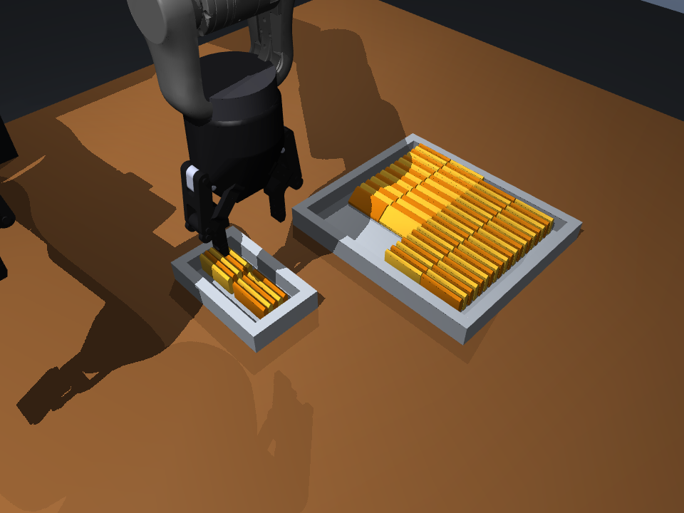

# A3 Dual-Arm MuJoCo Sandbox

An independent, policy-neutral MuJoCo environment for the fourteen-axis A3 dual-arm robot.
It supports code policies, keyboard teleoperation, canonical action replay, force feedback, and
LeRobot v3 dataset collection. It does not modify or depend on `vla_ur5e_sim`.

## 中文快速上手

当前新增的是 **倒角饼干的 5＋5 批量搬运基线**：左臂一次夹起五块，分两次放进桌面上的
小盒，右臂停在外侧。固定布局已完成整轮验证，但还不是随机场景下的可靠采集系统。
这是读取仿真真值的闭环规则 Expert，**不是 VLA，也不是通过相机识别饼干**。

### 先选对入口

| 想做什么 | 入口 | 是否录制训练数据 |
| --- | --- | --- |
| 看新版一次五块、两次共十块 | `examples/run_cookie_batch.py --render` | 否 |
| 看旧版右臂托盒、左臂逐块搬运 | `examples/run_cookie_transfer.py --config configs/cookie_cooperative.yaml --render` | 否；当前 80 块布局未验证完整成功 |
| 自己遥控试操作 | `a3-sim teleop --scene cookie_transfer --no-camera-render` | 否 |
| 人工录制示范 | `a3-sim teleop --scene cookie_transfer --record ... --repo-id ...` | 是；需要相机和数据集依赖 |
| 策略接口采集 / SmolVLA 训练 | 见下方数据集与训练说明 | 独立流程；新版 batch 演示尚未接入录制 |

**JSON 评估报告、诊断截图和训练数据集是三件不同的事。** 新版 batch 脚本不自动录制，
也不支持 `--record`；旧版 `evaluate_cookie_transfer.py` 评估的是逐块 Expert，不是新版 batch。

### 安装与可视化

以下命令在仓库根目录执行。已有环境的 WSL 用户先运行 `conda activate a3sim`。
仅运行仿真和测试不需要安装 LeRobot：

```bash
python -m pip install -e ".[dev]"

# 打开新版 5＋5 演示；默认读取 configs/cookie_batch.yaml，不录制数据。
unset MUJOCO_GL
python -u examples/run_cookie_batch.py --render --max-steps 6000
```

窗口中鼠标左键拖动旋转视角，右键拖动平移，滚轮缩放。
`unset MUJOCO_GL` 是清除离屏渲染设置，不是修复 WSLg 的命令；如果窗口仍不显示，
需要单独检查 WSLg/显示驱动。该演示默认不读取三路相机 RGB，图形窗口只用于观察。

### 不开窗口，保存结果

```bash
python -u examples/run_cookie_batch.py --seed 0 --max-steps 6000 \
  --output artifacts/my_cookie_batch_eval.json

# 可选：阶段截图，用于诊断，不是训练数据。
MUJOCO_GL=egl python -u examples/run_cookie_batch.py \
  --snapshots artifacts/batch_snapshots --debug

# 查看所有可用参数。
python examples/run_cookie_batch.py --help
```

成功应同时看到 `success: true`、`phase: DONE`、目标盒 10 块、源盒 70 块，
以及两批的 `lifted: 5` 和 `released: true`。脚本成功返回 0，失败或超步数返回 1。
仅“夹起来了”或“曾经放进去过”不算最终成功。

### 这次具体改了什么

- **模型**：饼干约 50 × 6.333 × 25 mm，上下边缘做 2.5 mm、45° 倒角，底部保留平面。
  batch 使用箱体核心＋上下倒角碰撞体，保留外形和碰撞质量，不把饼干绑定到夹爪。
- **场景**：仍为 4 × 20 共 80 块；batch 的间隙改为 2.5 mm，未预留整根手指宽的通道。
  目标盒加宽并移到左臂可达位置，放在桌上；原默认场景的 0.4 mm 间隙保留。
- **闭环控制**：读取实际位置、姿态、接触和抬升情况，选择露出端连续直立的五块，
  先保持张开接近抓取点上方，再把夹爪预闭合到批次宽度并确认实测开度稳定，随后插入、
  夹紧、验证抬升、搬运、释放、稳定检查后再选下一批。
  邻近饼干倾倒时跳过受阻端，而不是继续向下硬压；没有自动扶正功能。
- **物理参数**：batch 默认物理 1000 Hz、控制 20 Hz、滑动摩擦系数 0.8。
  摩擦在整个过程保持不变；插入阶段单侧指垫连续三个控制周期超过 8 N 会失败退出。
  这些均为仿真参数，并非真实硬件的标定值或安全保证。
- **判定**：要求十块释放后直立、稳定、完整进入小盒，源盒仍有七十块；
  不再要求 batch 满足旧任务的精确槽位／四面贴壁条件。

### 已验证的结果与限制

`artifacts/cookie_batch_baseline_seed0.json` 保存的是此前固定布局 seed 0 的 5＋5
基线：1844 个控制步、目标盒 10 块、源盒 70 块；两批为 ID 0–4 与 20–24，最大指垫力
约 4.48 N。当前版本改变了初始姿态与抓取阶段，已验证模型、预闭合状态机和短程无头运行，
**尚未重新完成整轮 5＋5 长程验收**；在新的报告出现前，不应把旧基线当作本版本的成功证明。



上图来自旧固定布局的诊断运行。**这不是当前版本或随机布局的成功率**：目前只改 seed 不会改变饼干布局，
也不保证任选五块、换尺寸或换摆放后仍能成功。源盒中部分剩余饼干可能倾倒。
开发时一轮无窗口运行约 21 分钟，对应约 92 秒仿真时间，当时还有另一轮诊断运行并行；
这不是独占机器的性能基准。当前优先验证接触与搬运，尚未优化到实时，暂不建议直接大规模采集。

### 文件导航与回归检查

| 文件 | 主要作用 |
| --- | --- |
| [configs/cookie_batch.yaml](configs/cookie_batch.yaml) | 新版 5＋5 的场景、接触和控制参数 |
| [examples/run_cookie_batch.py](examples/run_cookie_batch.py) | 演示入口、结果 JSON、诊断截图 |
| [src/a3_dual_arm_sim/batch_expert.py](src/a3_dual_arm_sim/batch_expert.py) | 五块选择、闭环状态机、抬升／释放验证 |
| [src/a3_dual_arm_sim/model.py](src/a3_dual_arm_sim/model.py) | MuJoCo 场景与倒角碰撞模型生成 |
| [src/a3_dual_arm_sim/cookie_transfer.py](src/a3_dual_arm_sim/cookie_transfer.py) | 饼干任务、接触查询、计数与成功判定 |
| [src/a3_dual_arm_sim/config.py](src/a3_dual_arm_sim/config.py)、[configs/default.yaml](configs/default.yaml) | 配置定义与原场景默认参数 |
| [src/a3_dual_arm_sim/expert.py](src/a3_dual_arm_sim/expert.py) | 原逐块 Expert 与共享运动规划 |
| [tests/test_cookie_batch.py](tests/test_cookie_batch.py) | 新版选取、接触链、失败保护等回归测试 |

```bash
python -m pytest tests/test_cookie_batch.py tests/test_model.py tests/test_cookie_transfer.py \
  -k "not expert and not evaluation" -q
```

这组相关测试为 30 项通过、5 项未选中；**不代表整个旧版 Expert 测试套件通过**。
下文保留通用接口与训练说明：
[动作与观测](#action-and-observation-contract) ·
[策略与数据采集](#replaceable-policies-and-collection) ·
[SmolVLA](#grasp-expert-and-smolvla) ·
[遥控](#keyboard-teleoperation) ·
[Batch 技术细节](#beveled-cookie-batch-expert-experimental)。

## What is modeled

- Seven URDF joints per arm, using the source link geometry, mass/inertia, limits, velocity, and
  effort values.
- Robotiq 2F-85 grippers using vendored robosuite visual meshes and an 85 mm, single-opening
  simplified parallel-jaw collision model. Each gripper exposes two fingertip touch signals,
  actuator force, and a wrist six-axis force/torque signal.
- Front, left-wrist, and right-wrist `256x256` RGB cameras.
- A central mast matching the photographed overhead mounting, a tabletop, deterministic reset,
  position control, rate limiting, and an emergency stop.
- Two separate scenes: the original three-object sandbox and a video-inspired cookie packing task
  with a `4x20` source bin, a `2x5` target box, and eighty upright thin cookie proxies.

The two source files `L_LAST_S.STL` and `R_LAST_S.STL` are invalid header-only files and are not
used. The arm STL files are visual geometry; conservative capsules are used for collision.

This is a **functional sandbox**, not a calibrated digital twin. The supplied robot package has
no motor transmission model, identified damping/friction, calibrated zero pose, controller gains,
camera calibration, or gripper calibration. The 2F-85 appearance comes from robosuite's MIT-licensed
meshes, but its linkage dynamics are intentionally reduced to synchronized parallel jaw travel.
Defaults are centralized in `configs/default.yaml` so they can later be replaced with measured parameters. Robot self-collision is also omitted in v1;
robot-to-table and robot-to-object contacts remain active.

## Install and inspect

Python 3.10+ and MuJoCo 3.3+ are supported. LeRobot is optional unless recording, replaying,
or training.

MuJoCo is pinned to the `3.3` series rather than left open-ended. The grasp is marginal by
construction - the parallel gripper opens to 69.7 mm against a 70 mm cube - so contact solving
decides whether a lift succeeds, and a newer `3.x` release changes that solve enough to break it (the
cube is pushed ~3.7 cm during finger closure and slips out on lift). That failure is silent: it does
not raise, it just makes every collected demonstration wrong. `3.3.7` is the verified version.

```bash

cd a3_dual_arm_sim/
# Simulation and tests only:
python -m pip install -e ".[dev]"
# Add dataset support only when needed:
python -m pip install -e ".[dataset,dev]"
# Add the training extra when using SmolVLA:
python -m pip install -e ".[train,dev]"

a3-sim inspect --write-xml models/a3_generated.xml
MUJOCO_GL=egl a3-sim smoke --steps 1000

# Compile and headlessly stabilize the cookie-transfer variant.
a3-sim inspect --scene cookie_transfer
MUJOCO_GL=egl a3-sim smoke --scene cookie_transfer --steps 1000
```

Use `MUJOCO_GL=egl` for headless execution. Do not set it when your platform requires a different
interactive OpenGL backend.

The editable install includes Pillow, Matplotlib, and OpenCV for camera inspection and future live
viewers. Save a labeled snapshot of all three policy cameras, or add `--show` to open it interactively:

```bash
MUJOCO_GL=egl python examples/preview_cameras.py
MUJOCO_GL=egl python examples/preview_cameras.py --show
```

The output directory contains the three original `256x256` frames plus `all_cameras.png`.

## Rendering modes

Use viewer-only mode while checking teleoperation. It opens a dedicated A3 control panel beside
MuJoCo's display-only Human Viewer, skips all three Policy RGB render passes, and does not record a
dataset:

```bash
unset MUJOCO_GL
a3-sim teleop --scene cookie_transfer --no-camera-render --steps 1000
```

The observation keys and shapes remain unchanged in this mode, but the three images are black. This
keeps state-only policies and the runner contract stable while avoiding the expensive offscreen GL
work. `--no-camera-render` is available on both `run` and `teleop`.

Use headless capture/policy mode when images are required. Leave camera rendering enabled (the
default), keep the Human Viewer off, and select EGL before the process starts:

```bash
MUJOCO_GL=egl a3-sim run --scene cookie_transfer \
  --policy your_package.your_policy:make_policy \
  --record outputs/datasets/a3_cookie_policy \
  --repo-id local/a3-cookie-policy --steps 1000
```

The CLI rejects `--no-camera-render` together with `--record` so an accidental debug launch cannot
write a dataset containing black camera streams. Manual keyboard collection is the necessary
exception to the viewer-off rule: `teleop --record ...` keeps both the Human Viewer and Policy RGB
on; keyboard input comes from the dedicated A3 control panel, not the viewer.

On a machine without a GPU the offscreen cameras dominate frame time: MuJoCo regenerates one
shadow map per light for every camera, and that cost does not depend on the camera resolution. Pass
`--fast-render` to `run`, `teleop`, or `collect-grasp` to skip the shadow and reflection passes,
which is roughly four times faster while keeping geometry, materials, and colours intact. The same
switch is available persistently through `render_shadows` and `render_reflections` in
`configs/default.yaml`.

On the current Python 3.13/MuJoCo/GLFW combination, a process that has owned both the interactive
viewer and offscreen camera renderer can otherwise segfault during interpreter shutdown even after
both contexts were explicitly closed. Interactive CLI commands therefore flush/close all project
state and bypass only that faulty native-library finalization step; their real exit status is still
preserved. This workaround is local to the CLI and can be removed after the native stack is upgraded.

## Action and observation contract

The canonical `joint_position` action is a physical 16-vector:

```text
[L_q1..L_q7, L_gripper, R_q1..R_q7, R_gripper]
```

Arm values are radians and grippers are normalized opening in `[0, 1]`. The optional normalized
`cartesian_delta` adapter accepts:

```text
[L_dx..L_dRz, L_gripper, R_dx..R_dRz, R_gripper]
```

Cartesian values are in `[-1, 1]`; gripper `-1` is closed and `+1` is open. Damped least-squares
IK maps them to the canonical joint targets. Every recorder stores the post-IK, safety-limited
16-vector so scripted, teleoperated, and learned episodes can be mixed.

Each observation contains:

| Key | Shape | Meaning |
| --- | ---: | --- |
| `observation.images.front` | `256x256x3` | front RGB |
| `observation.images.left_wrist` | `256x256x3` | left wrist RGB |
| `observation.images.right_wrist` | `256x256x3` | right wrist RGB |
| `observation.state` | `16` | logical arm joints and gripper openings |
| `observation.velocity` | `16` | matching velocities |
| `observation.eef_pose` | `14` | two positions and quaternions |
| `observation.force` | `18` | 12-D wrist wrench, four touch, two gripper forces |
| `time`, `safety_stop` | scalar | simulator time and safety state |

## Replaceable policies and collection

A plugin is a zero-argument factory returning an object with `action_mode`, `reset(context)`,
`act(observation, task)`, and `close()`:

```bash
# Included code controller
MUJOCO_GL=egl a3-sim run \
  --policy a3_dual_arm_sim.policy:make_sine_policy \
  --task "exercise both shoulders" --steps 200

# Collect a new LeRobot v3 episode (existing non-empty roots are protected)
MUJOCO_GL=egl a3-sim run \
  --policy a3_dual_arm_sim.examples.custom_policy:make_policy \
  --record datasets/a3_scripted --repo-id local/a3-scripted \
  --fast-render --steps 200

a3-sim replay --root datasets/a3_scripted --repo-id local/a3-scripted --episode 0 --render
```

The adapter boundary is also used by the included SmolVLA wrapper; another VLA can implement the
same four methods without changing the environment, runner, or recorder.

## Unified policy interface

`a3_dual_arm_sim/lerobot_policy.py` runs **any** LeRobot checkpoint - all sixteen registered types
(`act`, `diffusion`, `pi0`, `pi05`, `smolvla`, `vqbet`, `wall_x`, …) - through one adapter, so
switching model is configuration rather than code. LeRobot already provides the shared factory
(`make_policy`) and a checkpoint carries its own normalisation, so the only A3-specific work is
projecting an observation onto the keys a checkpoint declares and adapting the returned action back
to the A3 contract.

```bash
export A3_POLICY_CHECKPOINT="$PWD/outputs/training/cookie_smolvla/checkpoints/last/pretrained_model"
export A3_POLICY_DATASET_ROOT="$PWD/outputs/datasets/a3_cookie_overnight"
export A3_POLICY_REPO_ID="local/a3-cookie-overnight"
# Optional: A3_POLICY_TYPE, A3_POLICY_DEVICE, A3_POLICY_DTYPE,
# A3_POLICY_N_ACTION_STEPS, A3_POLICY_RENAME_MAP, A3_POLICY_LOAD_VLM_WEIGHTS
MUJOCO_GL=egl a3-sim run --scene cookie_transfer \
  --policy a3_dual_arm_sim.lerobot_policy:make_policy \
  --task "transfer exactly ten upright square cookie blocks into the 2x5 box" \
  --fast-render --steps 800
```

`--fast-render` is not optional here. The cookie dataset was collected with it, so a checkpoint
consuming those images must render the same way: the shadow and reflection passes change the policy
cameras by 3.6 intensity levels on average but up to 112 of 255 on the pixels near a contact shadow
(measured by `scripts/measure_render_consistency.py`), which is far outside the training distribution. The rule
is to match whatever the data was collected with: `scripts/evaluate_cookie_policy.py` and
`scripts/render_cookie_policy_video.py` call `use_fast_render()` unconditionally for this reason.

Two things the adapter does because LeRobot does not. It **validates the checkpoint's declared
observation keys**, since LeRobot accepts a missing camera silently: dropping a declared camera still
returns a valid-shaped action, emits no warning, and quietly degrades the rollout. And it **clears
`load_vlm_weights`** for checkpoints that already embed the VLM, because `lerobot/smolvla_base` stores
all 450 M parameters yet still asks for SmolVLM2's separate 2 GB of weights, which fails outright on an
offline worker.

`docs/policy-interface.md` records the measured LeRobot behaviours this design rests on, the interface
sketch, and the migration path. Read it before extending the adapter.

## Cookie transfer scene

This section describes the **default / legacy single-Cookie configuration**.
The batch configuration overrides spacing, box geometry and support, contact settings,
and success criteria; see [the batch baseline](#beveled-cookie-batch-expert-experimental).

`A3CookieTransferEnv` is a separate task variant based on the supplied deployment photograph and
4.8-second packing video. The A3 base is carried by a central dark mast, the arms start in a hanging
ready pose mirrored about the central stand. Eighty cookie proxies begin upright in four columns
of twenty. Each piece is 50 mm wide, 6.333 mm thick, and 25 mm high (one-third of the
previous thickness and half the previous height); mass scales by the same volume ratio to
5.83 g. Their upper and lower long edges have a configurable 2.5 mm, 45-degree
bevel in both the visible and collision meshes, while the full middle remains
6.33 mm thick. Adjacent pieces still have only 0.4 mm clearance at the middle;
the bevel guides finger contact but does not by itself guarantee a collision-free
insertion. The source cavity is approximately
207.2 × 140.27 mm, leaving 3 mm between the packed array and each wall;
the empty destination cavity is 100.4 × 33.27 mm with 2 × 5 slots.
Both boxes sit toward the right arm (world -y); the destination's two columns align
with source columns 0/1, with matching row pitch and grid alignment.
Source walls rise 30 mm above the inside floor; destination walls rise 25 mm,
matching cookie height. Their geometry includes an additional 6 mm below the floor top.
Box walls overlap at all four corners,
so there are no corner escape gaps. Both boxes use the same uniform light-gray material while the
cookie proxies alternate between two yellow-orange shades, making adjacent tightly packed pieces
visually separable without debug markers. Look down into the boxes using the rotatable
viewer to inspect the pieces behind the raised walls. The
source material provides no metric calibration, so stand, bin, camera, and cookie dimensions are
explicit approximations rather than claimed real-world measurements.

Success is not inferred from an arm waypoint. Exactly ten complete pieces must be upright and stable
inside the target box, with one piece assigned to each `2x5` slot and the packed array reaching all
four inner walls, while the other seventy remain in the source bin. This exact fill must persist below the linear/angular speed limits for 20 consecutive
control steps (one second). Counts, per-piece masks, slot occupancy, and the hold counter are reported
in `info`; they remain privileged task/evaluation state and are not added to the policy observation.

```bash
# Open the scene with a stationary policy for visual inspection.
unset MUJOCO_GL
a3-sim run --scene cookie_transfer \
  --policy a3_dual_arm_sim.policy:make_hold_policy --render --steps 1000

# Keyboard demonstration, saved through the same canonical 16-D recorder.
a3-sim teleop --scene cookie_transfer \
  --task "transfer exactly ten upright square cookie blocks into the 2x5 box" \
  --record outputs/datasets/a3_cookie_manual \
  --repo-id local/a3-cookie-manual --steps 1000

# Any code or VLA policy uses exactly the same scene/runner boundary.
MUJOCO_GL=egl a3-sim run --scene cookie_transfer \
  --policy your_package.your_policy:make_policy \
  --task "transfer exactly ten upright square cookie blocks into the 2x5 box" \
  --record outputs/datasets/a3_cookie_policy \
  --repo-id local/a3-cookie-policy \
  --fast-render --steps 1000
```

Pass `--fast-render` whenever a policy consumes the camera images, and use the same choice for every
dataset you record, so a training set is never a mixture of two lighting configurations. Omitting it
is only safe for policies that never look at the cameras.

`A3CookieTransferExpert` is a privileged, feedback-driven state machine rather than a VLA. It
replans one Cookie at a time, verifies grasp/lift/release/slot outcomes from simulator truth, and
retries failed phases. These privileged checks are Expert-only and are not added to policy
observations.

Run one visible demonstration or a headless evaluation report with:

```bash
python examples/run_cookie_transfer.py --render
python examples/evaluate_cookie_transfer.py --seeds 0-19 \
  --output artifacts/cookie_transfer_dev.json
python examples/evaluate_cookie_transfer.py --seeds 100-119 \
  --output artifacts/cookie_transfer_validation.json
```

The JSON report records success, verified grasp/lift, transfer drops, completed Cookies, failed
Cookie and phase, failure reason, maximum left-gripper touch force, steps, final source/target
counts, slot occupancy, and retries. With the current zero pose-noise configuration, different
seeds intentionally share the same layout; seed sweeps become meaningful after noise is enabled.

## Grasp expert and SmolVLA

`A3GraspEnv` randomizes a red cube in the reachable left-arm workspace. Its success check is
physical rather than waypoint-based: both fingers must contact the cube, the cube must be centered
inside the gripper and clear of the table, and it must remain at least 8 cm above its reset height
with low linear/angular velocity for 20 consecutive control steps (one second). `A3GraspExpert`
computes absolute joint waypoints with MuJoCo kinematics and then executes approach, two-finger
closure, lift, and stable-hold phases. Object pose is privileged only to the scripted expert and is
not part of the policy observation.

Collect only successful demonstrations (failed attempts are discarded):

```bash
MUJOCO_GL=egl a3-sim collect-grasp \
  --root outputs/datasets/a3_grasp_100 \
  --repo-id local/a3-grasp-100 --episodes 100 --seed 0 \
  --fast-render
```

Every training launch first rejects non-v3 data, wrong camera/state/action shapes, inconsistent
episode metadata, and unsuccessful episodes. The A3 adapter changes the supplied SmolVLA base from
its original 10-D state, 7-D action, and two cameras to the A3 16-D state, 16-D action, and three
cameras. SmolVLA already pads state and action to 32 internally, so this does not change learned
weight shapes. The large base weights are symlinked into a generated runtime view instead of copied.

```bash
# Inspect the exact command and feature contract without starting training.
a3-sim train-smolvla \
  --root outputs/datasets/a3_grasp_100 --repo-id local/a3-grasp-100 \
  --output outputs/train/a3_grasp_smolvla --dry-run

# Formal GPU run. The default base checkpoint is the sibling reference repository's local asset;
# use --model /path/to/pretrained_model to select another compatible SmolVLA checkpoint.
a3-sim train-smolvla \
  --root outputs/datasets/a3_grasp_100 --repo-id local/a3-grasp-100 \
  --output outputs/train/a3_grasp_smolvla \
  --steps 20000 --batch-size 4 --device cuda
```

Run a saved checkpoint through the same `EpisodeRunner` policy interface:

```bash
export A3_SMOLVLA_CHECKPOINT="$PWD/outputs/train/a3_grasp_smolvla/checkpoints/last/pretrained_model"
export A3_SMOLVLA_DATASET_ROOT="$PWD/outputs/datasets/a3_grasp_100"
export A3_SMOLVLA_REPO_ID="local/a3-grasp-100"
export A3_SMOLVLA_DEVICE="cuda"
MUJOCO_GL=egl a3-sim run \
  --policy a3_dual_arm_sim.smolvla_policy:make_policy \
  --task "pick up the red cube" \
  --fast-render --steps 300
```

`--fast-render` must match however the grasp dataset above was collected, for the reason given in the
unified-policy section: the lighting passes move pixels far enough to matter to a vision policy.
`collect-grasp` and `run` both accept the flag, so record and evaluate with the same choice.

`smolvla_policy.py` is the original SmolVLA-only wrapper, kept because the grasp workflow above and
existing checkpoints reference it. New work should use the unified adapter in `lerobot_policy.py`,
which covers this same checkpoint and fifteen other policy types without any per-model code.

The one-step smoke proves loading, preprocessing, forward/backward, optimizer update, and checkpoint
serialization only. It is not evidence that the model learned the task. A meaningful run needs many
diverse successful demonstrations, held-out seeds, full training, and closed-loop success evaluation.
On the current host PyTorch reports no usable CUDA driver, so long CPU training is intentionally not
presented as the recommended workflow. TorchCodec may also warn on this installation; the recorder
and trainer explicitly use the available PyAV image path.

## Cookie-transfer VLA pipeline

The cookie task has a complete collect → merge → train → evaluate → record loop under `scripts/`.
These are standalone scripts rather than CLI subcommands because the later stages run on a Slurm GPU
node, where MuJoCo cannot be imported at all - see the package docstring for why.

### 1. Collect demonstrations in parallel shards

```bash
# Default: 8 shards x 6 episodes, one dataset per shard.
bash scripts/collect_cookie_nightly.sh

# A second batch while the first still runs (separate output tree, separate seeds).
bash scripts/collect_cookie_batch.sh a3_cookie_overnight_b 8 6 480
```

Each shard must own its output directory: LeRobot writes one parquet file and one video set per
dataset, so concurrent writers cannot share a root. Seeds are interleaved across shards
(`shard_index + attempt * shard_count`), so the union of shards is still one clean seed sweep. The
underlying command is `a3-sim collect-cookie`, which also takes `--position-noise`, `--yaw-noise`,
`--hold-steps`, and `--fast-render`.

### 2. Merge the shards into one training dataset

```bash
python scripts/merge_cookie_shards.py \
  --shards outputs/datasets/a3_cookie_overnight/shard_* \
  --repo-id local/a3-cookie-overnight-merged \
  --output outputs/datasets/a3_cookie_overnight_merged
```

Wraps LeRobot's `aggregate_datasets`, then renumbers `episode_index` sequentially and re-emits a
single `a3_episode_metadata.jsonl` and `collection_summary.json` for the whole run; per-shard records
keep a `source_shard` field.

### 3. Train

```bash
# Inspect the exact command and feature contract without starting training.
a3-sim train-smolvla \
  --root outputs/datasets/a3_cookie_overnight_merged \
  --repo-id local/a3-cookie-overnight-merged \
  --output outputs/training/cookie_smolvla --dry-run

# Formal GPU run: steps, then batch size.
sbatch scripts/train_cookie_smolvla.sh 20000 4
```

Training first floors the normalisation statistics. The right arm holds the target bin and never moves
in this dataset, and LeRobot's cross-shard aggregation leaves a spurious ~1e-10 standard deviation
there; because the normaliser divides by `std + 1e-8`, that turns float32 rounding noise into
normalised values in the hundreds and the loss starts near 3e3 instead of single digits. See
`statistics.py` for the reasoning; `train_smolvla(..., std_floor=...)` changes the floor, and
`degenerate_dimensions()` reports which dimensions triggered it before anything is written.

### 4. Evaluate closed loop

```bash
python scripts/evaluate_cookie_policy.py \
  --checkpoint outputs/training/cookie_smolvla/checkpoints/last/pretrained_model \
  --episodes 5 --first-seed 0 --output outputs/eval/cookie.json
```

Reports the task's own success criterion plus the peak fill and how often a placed cookie was knocked
back out. Read the spread across episodes rather than one number: inference is stochastic, and the
same seed and scene produced peaks of 6, 1 and 1 cookies in three measured runs.

### 5. Record a rollout and chart it

```bash
# Whole episode by default; --steps N stops earlier, --view-size 0 drops the scene view.
python scripts/render_cookie_policy_video.py \
  --checkpoint outputs/training/cookie_smolvla/checkpoints/last/pretrained_model \
  --output outputs/videos/rollout.mp4

# The scripted expert through the same code path, as a reference.
python scripts/render_cookie_policy_video.py --expert --output outputs/videos/expert.mp4

# Chart the phase trace the renderer logged.
python scripts/plot_rollout_trace.py logs/render_video.log --output outputs/videos/trace.png
```

The video composites a `480x480` render of the scene camera with the three policy cameras as labelled
insets, because the policy cameras are pinned to their 256x256 training resolution and are too small
to judge what the arm is doing. It overlays the policy's identity, the cookie counts, and the phase
index - the demonstrated frame the arm's joint state currently matches. Phase is what makes a
125-second recording legible: it advances 1:1 while the policy is doing well, and jumps backwards once
it starts replaying an earlier cycle. The chart plots that trace against its diagonal reference. Both
need only Pillow and PyAV; the `ffmpeg` binary is not required.

## Known limitations

- **Demonstration diversity is the binding constraint.** `A3CookieTransferEnv.reset` writes
  `DEPLOYMENT_HOME` into `qpos` on every episode, so all collected episodes begin from an identical
  arm pose, and the only variation is a few millimetres of cookie placement - roughly one pixel at
  `256x256`. The demonstrations are therefore visually near-identical, and a policy can minimise loss
  by memorising one joint trajectory. Measured rollouts show exactly that: it tracks the demonstration
  for the first two or three cookies and then diverges without recovering. Improving this needs a
  randomised initial pose and enough placement noise for the cameras to see it, not more tuning.
- **One episode is not a measurement.** SmolVLA's flow-matching sampler restarts from fresh noise at
  every re-plan, so identical seeds give materially different episodes.
- **A partial policy runs to the horizon.** `terminate_on_success` fires only when the exact fill holds
  for a full second, so a weak policy runs all 2500 steps (about 20 minutes on CPU). Judge such a run
  by the peak fill it reached, not by its final count.
- **The normalisation floor repairs a symptom.** Flooring `std` makes training well-behaved on a
  dataset with constant dimensions, but a constant dimension is itself a data problem: the right arm
  should eventually be doing something.

## Keyboard teleoperation

Idle Cartesian arms retain their last commanded joint positions, including while
recording or controlling only the other arm. The cookie scene uses ideal model-based
arm gravity compensation, routed through force-limited joints; payload tracking
error can still occur. This is a simulator approximation requiring real calibration.

The cookie scene starts with both tool axes pointing down, a 1.10 m base height,
and separated bins. The target bin is a free rigid body initially resting on the
table; it follows the right gripper only through contact, never through a weld or
kinematic attachment. The legacy cooperative expert first approaches its near rim, verifies both
finger contacts, raises it 3 cm, and commands an 8-degree tilt. The left arm then
transfers cookies while the right arm holds its grasp. Missing support or unstable
released cookies are reported as failures, not counted as completed transfers.

Tune `cookie_transfer.base_height_m`, `deployment_home`,
`target_bin_world_position_m`, `box_lift_m`, `box_tilt_deg`, `right_grasp_pitch_deg`, and the two
`*_gripper_kp` values in `configs/default.yaml`. These gains, contact parameters,
box mass, and mount dimensions are prototype estimates. Changing mount height
requires solving a compatible home pose again. The old `target_bin_attach_*`
fields are retained for right wrist camera compatibility; they no longer attach
the box to the arm.

Cooperative expert preview (experimental, **not a verified ten-cookie expert**).
The new thin 80-cookie scene changes grasp clearances and box dimensions; the
existing expert's grasp waypoints still need retuning for this layout. Use the hold
policy or teleoperation to inspect the updated environment.

```bash
# Run from the repository root.
unset MUJOCO_GL
python examples/run_cookie_transfer.py \
  --config configs/cookie_cooperative.yaml --render --max-steps 6000
```

The viewer starts in free-camera mode at the front oblique viewpoint: left-drag
rotates, right-drag pans, and the wheel zooms. This does not change recorded policy
camera poses. The current contact-based expert still encounters interference in
the near rows. It stops on support loss, disturbed previously packed cookies, or
placement timeout, rather than sweeping back through the loaded box. Check final
`Success` and `Cookies in Target Bin`; a historical verified placement is not proof
that the cookie remains packed. Do not use failed attempts as successful training
demonstrations. The ideal gravity compensation and simplified Robotiq jaws are
simulation approximations, not real-hardware controller calibration.

Historical regression on the previous 30-cookie layout (`--max-steps 6000`) stopped at step 2412:
six historical verified placements, five cookies passing final containment checks,
and `success=false` after a packed cookie was disturbed. Right box support remained
verified (about 9.9 degrees tilt). The report is
`artifacts/cooperative_guarded_seed0.json`; this is a partial failure result, not
a ten-cookie success-rate benchmark.

```bash
a3-sim teleop --record datasets/a3_manual --repo-id local/a3-manual \
  --task "manual tabletop demonstration"
```

Teleoperation opens two windows. Keep keyboard focus on **A3 Teleoperation Control**; use the MuJoCo
Viewer only to watch the robot or adjust the viewing camera with the mouse. This prevents movement
keys from activating MuJoCo's built-in wireframe, joint, geometry-group, and pause shortcuts. The
control panel also provides press-and-hold buttons, arm selection, a speed slider, gripper controls,
recording status, normal/discard exits, and a red emergency-stop button.

- `1`, `2`, `3`: select left, right, or both arms
- `W/S`, `A/D`, `R/F`: world-frame `+X/-X`, `+Y/-Y`, `+Z/-Z` translation
- `I/K`, `J/L`, `U/O`: world-frame `+Rx/-Rx`, `+Ry/-Ry`, `+Rz/-Rz` rotation
- `[` / `]`: close / open gripper
- `P`: pause/resume recording; `Space`: emergency stop
- `Q`: save and quit; `X`: discard and quit

Keyboard and panel buttons keep moving while held and stop on release. The mouse keeps MuJoCo's
standard orbit, pan, and zoom behavior for inspecting the scene.

Episode metadata is stored in `a3_episode_metadata.jsonl`, including source controller, source
action mode, canonical stored action mode, seed, task, frame count, and optional success label.

## Beveled-Cookie batch expert (experimental)

`run_cookie_batch.py` is the separate five-at-a-time controller; the original
`run_cookie_transfer.py` still runs the single-Cookie expert.

```bash
# Interactive trial; does NOT record a training dataset.
unset MUJOCO_GL
python -u examples/run_cookie_batch.py --render

# Headless evaluation; write only the requested JSON result.
python -u examples/run_cookie_batch.py --seed 0 --output artifacts/batch_eval_seed0.json

# Controlled parameter comparison; the coefficient stays constant throughout.
python -u examples/run_cookie_batch.py --sliding-friction 0.8 --physics-hz 1000

# Optional diagnostic screenshots (not training observations).
MUJOCO_GL=egl python -u examples/run_cookie_batch.py \
  --snapshots artifacts/batch_snapshots --debug
```

The batch configuration is `configs/cookie_batch.yaml`. Cookie dimensions and
2.5 mm bevels are unchanged. The source has 80 Cookies, with a uniform 2.5 mm gap
instead of 0.4 mm; there are **no pre-cut finger-width lanes**. The left gripper
first reaches the pose above the Cookies with fully open jaws, then pre-closes
to the computed five-Cookie width and waits for the measured opening to settle.
It descends slowly through the bevels, compresses five neighbouring Cookies, checks
a contact chain through all five, and verifies that each actually rises. The
second batch prefers the same column after the first five are removed. If a
neighbour tips during extraction, the expert skips that obstructed end and
selects five upright Cookies at the opposite exposed end (then another column
if necessary). It does not keep pushing into the fallen Cookie.
Insertion stops if either pad exceeds 8 N for three consecutive control ticks;
this is a simulation guard, not a calibrated real-hardware force limit.
The target box is widened to leave space for the fingers to open and retract.
Its table position is moved to (0.095, 0.100, 0.753) m so both columns are
reachable with a vertical left-hand grasp. The expert checks both placement
columns at low/high clearance before grasping; joint limits are not relaxed.

The batch uses an exact compound collision solid (box core plus upper/lower
beveled mesh caps), preserving the visible shape and total collision mass.
All pieces are included in finger/contact-chain detection. Sliding friction is
0.8; it is constant through insertion and transport, not switched per phase.
Thin stacked Cookies require tighter contact settings and a smaller integration
step: this configuration uses 1000 Hz physics and 20 Hz control. These are
simulation settings, not measured hardware/material calibration. Camera RGB
rendering remains disabled during the trial, apart from explicitly requested
diagnostic screenshots.

Success requires exactly ten Cookies released, upright, settled and geometrically
inside the target, with seventy left in the source. The old exact-slot/wall-touch
criterion is retained for the original task but is not required by this batch
trial. A reported lift is not a successful placement. Read the final JSON
`success`, `batches` and `failure_reason`; failed trials must not be labelled as
successful demonstrations. The controller uses simulator truth, not a VLA, and
never attaches or teleports Cookies during execution.

This batch trial intentionally uses a **tabletop target box**, with the right
arm parked. Two top-down 2F85 housings interfere around the small box opening;
continuous right-arm box holding is therefore not part of this baseline.
The original cooperative single-Cookie example remains available separately.
The runner currently fixes the Cookie layout: changing the seed alone is not a
random-layout robustness test. This is an experimental contact-control baseline,
not a guarantee of reliable demonstrations or a calibrated real-world model.

Reference validation (2026-09-17, fixed layout, seed 0): two full replays
completed 5 + 5 in 1844 control steps, with 10 released/upright/settled Cookies
in the target and 70 remaining in the source. The final default-config replay
included the insertion-force guard. It selected IDs 0-4 and 20-24 because the
remaining ends of the first column had tilted. Maximum measured pad force was
4.48 N and the maximum monitored Cookie/pad contact penetration was 0.095 mm.
Thirty relevant model/contact/task tests passed; this is not a full legacy-expert
suite pass or a randomized-layout success-rate result.

Known limitations: neighbouring Cookies can still tip and are skipped, not
restored. Throughput is not yet optimized: the development headless replay took
about 21 minutes for roughly 92 seconds of simulated control, with another
diagnostic replay running concurrently. Do not expect real-time playback or
start large dataset collection on the basis of this one fixed-layout baseline.
