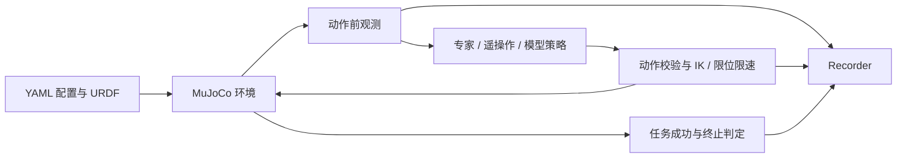
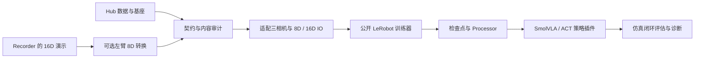

# 项目架构

## 系统组成

项目以 MuJoCo 环境和公共策略契约为中心。相同的执行链路支持规则专家、遥操作及 SmolVLA、ACT；任务判定在环境侧完成，数据录制在策略之外完成。

| 子系统 | 职责 | 主要维护入口 |
| --- | --- | --- |
| 基础配置与协议 | YAML 配置、动作/观测校验、episode 上下文、资源定位 | `config.py`、`contracts.py`、`paths.py` |
| `sim` | URDF 解析、机器人/物体构建、MuJoCo step、IK、相机和力反馈 | `sim/env.py`、`sim/model.py` |
| `tasks` | 抓取与装盒任务、释放、计数、稳定保持和成功条件 | `tasks/grasp.py`、`tasks/cookie_transfer.py` |
| `controllers` | 专家状态机、恢复、扶盒及遥操作 | `controllers/*expert.py`、`controllers/teleop.py` |
| `policies` | Python 插件和 SmolVLA / ACT 推理、反归一化及可选后处理 | `policies/base.py`、`policies/smolvla.py`、`policies/act.py` |
| `data` | 录制、成功演示采集、左臂转换及审计 | `data/recording.py`、`data/audit.py` |
| `learning` | Hub 下载、基座适配、训练命令和训练启动 | `learning/download.py`、`learning/training.py`、`learning/act_training.py` |
| `workflows` | 公共运行循环、benchmark、诊断与实验编排 | `workflows/runner.py`、`workflows/benchmark.py` |

`a3-sim` 在 `cli.py` 解析参数，由 `workflows/cli_handlers.py` 调用具体功能。`examples/` 为正式模块的脚本转发入口，业务实现保持在包内。Torch 和 LeRobot 仅在使用对应功能时加载。

## 仿真与策略执行

环境以控制周期输出观测，每个控制周期包含多个物理步。策略输出绝对关节目标或笛卡尔增量；环境执行校验、转换和限制，并在 `info` 中返回实际应用动作。Runner 管理 reset、策略绑定、step、录制和关闭，策略不负责重新实现任务判定。

专家通过 `bind_env()` 获取环境真值；模型插件通过观测推理。诊断可记录物体位置、动作和计数，但这些真值不能注入模型观测作为纯视觉评估输入。

## 数据与模型流程

SmolVLA 基座权重保持原文件，训练准备阶段生成独立配置视图和权重链接；源基座不被修改。训练器使用当前数据统计量创建/更新 processor 并保存至检查点。部署读取对应检查点及训练数据元数据，统一使用 LeRobot processor。

8D 模型仅观察/预测左臂状态动作；三路相机仍输入模型。部署在 reset 后读取并保持右臂初始目标，组合成环境需要的 16D 动作。

## 资源、输出与扩展

源码安装从仓库读取 `assets/`、`configs/`；构建 wheel 时复制至包内 `_resources/`。`resource_root()` 定位只读资源，`project_root()` 在源码安装定位仓库，在 wheel 安装使用调用者工作目录存放相对输出。缓存遵循 Hugging Face 标准环境变量，不在导入模块时改写缓存位置。

新策略实现 `reset(context)`、`act(observation, task)`、`close()`，并声明 `action_mode`；需要环境时可提供 `bind_env(env)`。工厂使用 `module:factory` 加载，参考 `src/a3_dual_arm_sim/examples/custom_policy.py`。物理改动归属 `sim`/配置，成功条件归属 `tasks`，录制归属 `data`，模型推理归属 `policies`。

ACT 通过 `train-act` 创建公开 LeRobot 的 ACTConfig，使用独立的 MEAN_STD processor 和动作队列。可选时间集成要求 `n_action_steps=1`；reset 清空队列或集成历史。ACT 新策略默认采用 ImageNet ResNet18 骨干初始化，训练检查点包含全部权重，部署无需重新下载骨干。
